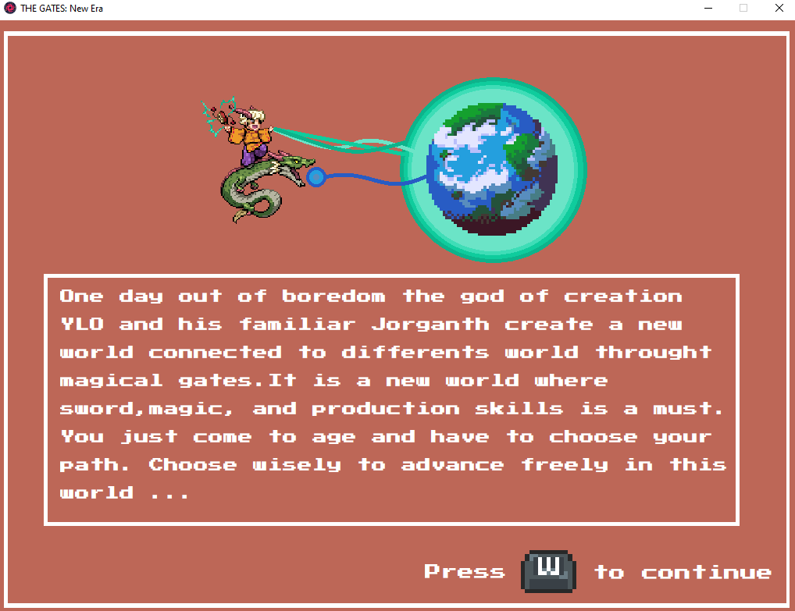

# THE_GATE

 Prototype d'un jeu du style Action/Turn-based que j'aimerais développer avect mes propres ressources graphiques. Il est réalisé grâce au langage Lua et la framework Love2D pour le codage et le logiciel Paint de Windows pour les interfaces.
 
 # Systèmes Implémentés

 + Une page d'acceuil d'où débute le jeu :
 
 + Une interface histoire (placant le contexte du jeu) :
 
 + Un système de classes avec de multiple stats à suivre :
 + 

   
On utilise les touche directionelle du clavier pour naviguer entre les différente classe, la souris pour naviguer entre les différents type de stats & W du clavier  pour valider le choix sur la classe selectionner par le selecteur. 

 
 
 
 # Systèmes à Implémentés
 
 + Une interface principale pour la gestion de tous le jeu :
 + Un système de crafting basé sur des stats :
 + Un système d'inventaire catégorisé :
 + Une interface de suivi de profil :
 + Un système de boutique :
 + Un système de sauvegarde de partie :
 + Un système de combat au tour par tour :
 + Base de donnée de monstres / items / classes / skills :
