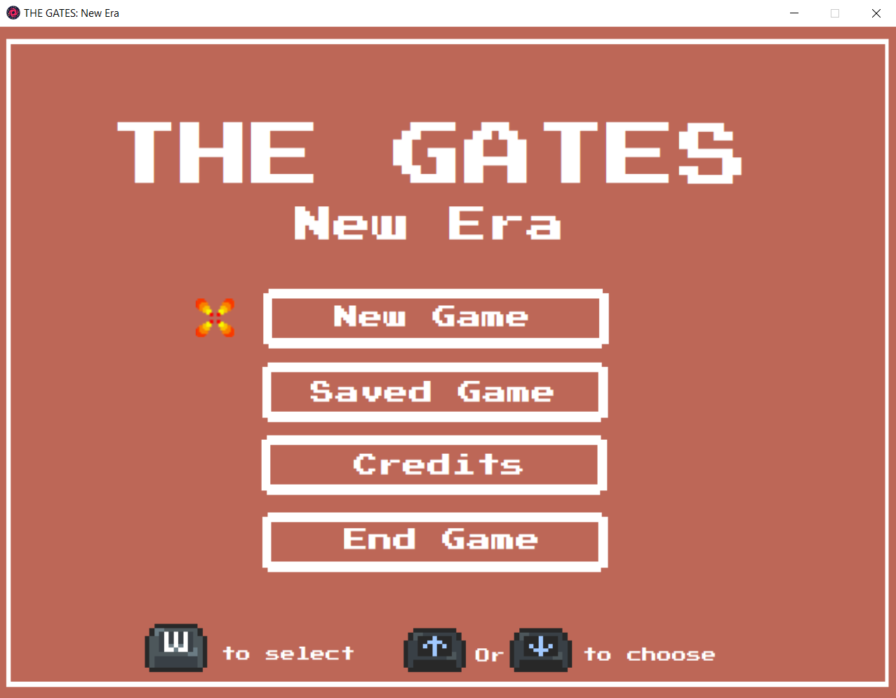

# THE_GATE
 Game prototype of a action/turn-based game i would like to develop with tmy own assets. It is developped in Lua and LOVE 2D framework for the script and the interface has been made using the software Paint from Windows OS.
 
 # Systèmes Implémentés

 + Une page d'acceuil d'où débute le jeu :
 
 
 + Une interface histoire (placant le contexte du jeu) :
 + Un système de classes avec de multiple stats à suivre :

 # Systèmes à Implémentés
 
 + Une interface principale pour la gestion de tous le jeu :
 + Un système de crafting basé sur des stats :
 + Un système d'inventaire catégorisé :
 + Une interface de suivi de profil :
 + Un système de boutique :
 + Un système de sauvegarde de partie :
 + Un système de combat au tour par tour :
 + Base de donnée de monstres / items / classes / skills :
